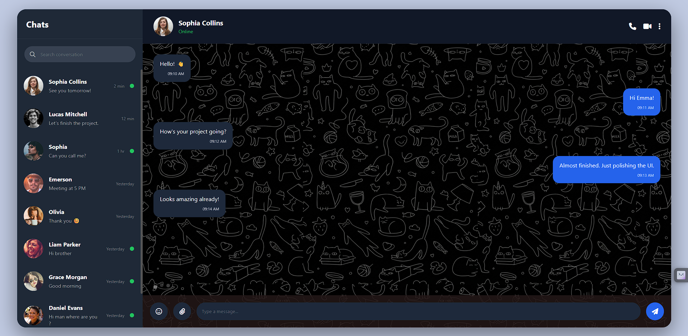
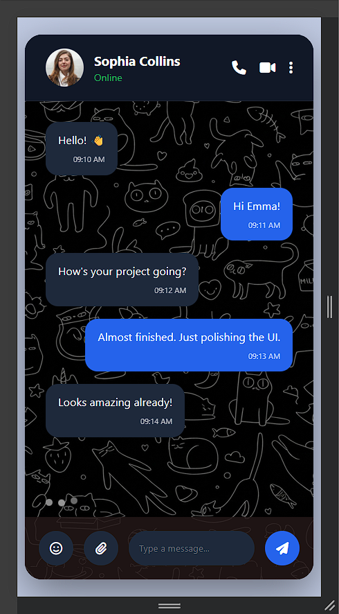

# 💬 Chat Application UI

A responsive **Chat Application UI** built using **HTML, CSS, and JavaScript**.

This project showcases a modern messaging interface using **dummy chat data** to simulate real conversations. It focuses entirely on the frontend design and user experience, with no backend or real-time messaging functionality.

---

## Features

* Modern chat application interface
* Responsive design
* Sidebar with chat list
* Search conversations
* User profile header
* Online status indicators
* Dummy chat conversations
* Sent & received message bubbles
* Message timestamps
* Typing indicator animation
* Emoji button UI
* Attachment button UI
* Send message button
* Smooth hover animations
* Clean dark theme

---

## Screenshots





---

## Technologies Used

* HTML5
* CSS3
* JavaScript (ES6)

---

### Live Demo

**Live Link:** https://abhijith-e0.github.io/chat-app-ui/

---

## Project Structure

```bash
Chat-Application-UI/
├── image/
│   ├── Screenshot1.png
│   └── Screenshot2.png
├── index.html
├── style.css
├── script.js
└── README.md
```

---

## Future Improvements

* Real-time messaging
* User authentication
* Emoji picker
* Voice messages
* File sharing
* Read receipts
* Chat wallpapers
* Light/Dark mode toggle
* Mobile navigation menu
* Backend integration

---

## Author

**Abhijith Ee**

GitHub: https://github.com/Abhijith-E0
